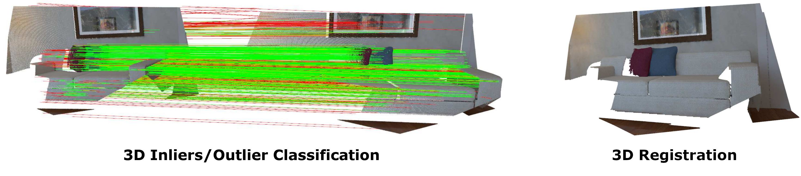
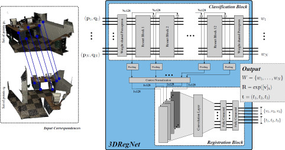
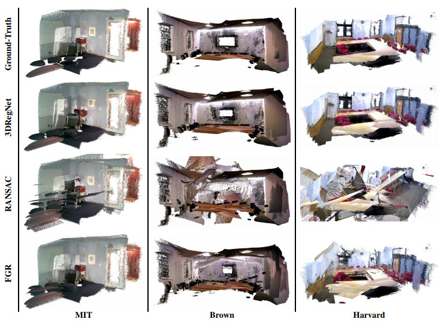

# 3DRegNet: A Deep Neural Network for 3D Point Registration
G. Dias Pais<sup>1</sup>, Pedro Miraldo<sup>1,2</sup>, Srikumar Ramalingam<sup>3</sup>, <br /> Jacinto C. Nascimento<sup>1</sup>, Venu Madhav Govindu<sup>4</sup>, and Rama Chellappa<sup>5</sup>

<sup>1</sup>Instituto Superior Tecnico, Lisboa  <sup>2</sup>KTH Royal Institute of Technology  <sup>3</sup>University of Utah<br />
<sup>4</sup>Indian Institute of Science, Bengaluru  <sup>5</sup>University of Maryland, College Park
<br />
E-Mail: goncalo.pais@tecnico.ulisboa.pt




This project provides the opensource code for 3DRegNet, a deep learning algorithm for the registration of 3D scans. Given a set of 3D point correspondences, we build a deep neural network using deep residual layers and convolutional layers to achieve two tasks: (1) classification of the point correspondences into correct/incorrect ones, and (2) regression of the motion parameters that can align the scans into a common reference frame.

If you want to use this open source, please cite:
```
@article{pais19,
  title={3DRegNet: A Deep Neural Network for 3D Point Registration},
  author={G. Dias Pais and Pedro Miraldo and Srikumar Ramalingam and
            Jacinto C. Nascimento and Venu Madhav Govindu and Rama Chellappa},
  journal={arXiv:1904.01701},
  year={2019}
}
```

## Method
We build a deep neural network using deep residual layers and convolutional layers to achieve. The network architecture is shown below.

<p align="center"></p>

**Classification Block:** The input to our network is a set of 3D point correspondences. 
Each point correspondence (6-tuples) is processed by a fully connected layer with 128 ReLU activation functions.
There is weight sharing for each of the individual N point correspondences, and the output is of dimension Nx128 where we generate 128 dimensional features from every point correspondence. 
The Nx128 output is then passed through 12 deep ResNet blocks, with weight-shared fully connected layers instead of convolutional layers.
At the end, we use another fully connected layer with ReLU followed by tanh units to produce the weights. 

**Registration Block:** The input to this block are the features extracted from the point correspondences.
We use pooling to extract meaningful features of dimensions 128x1 from each layer of the classification block.
We extract features at 13 stages of the classification, i.e., the first one is extracted before the first ResNet block and the last one is extracted after the last (12th) ResNet block.
After the pooling is completed, we apply context normalization and concatenate the 13 feature maps (size 13x128), which is then passed on to a convolutional layer, with 8 channels. The output of the convolution will then be injected in two fully connected layers with 256 filters each, with ReLU between the layers, that generate the output of six transformation parameters, in which the rotation is parameterized by the axis-angle representation (other representations for the rotation are available in the [config.py](config.py)).

## Configuration
The project requires pip and CUDA 9 or 10. To install the required python libraries run the code below:
```
pip install -r requirements.txt
```

## Train
The network hyperparameters and other configurations can be change in the config.py. To train the network, run the following code:
```
makedir logs

python3 main.py --log_dir=[NAME] 
```
The weights will be saved in the log directory and can be later used for testing.

The SUN3D dataset ready for training, i.e. the 3D correspondences given by FPFH, and the weights for a pre-trained network using this dataset are available for download in the following [this link](https://www.dropbox.com/sh/ct1vpvezn3cw2my/AACmKGVOlvAOz6nDYjsw_Bwpa?dl=0).

To train and test the network with this dataset, one should unzip the sun3d.zip file into the data folder to have a folder tree such as
````
data/sun3d/(test, train)
````

## Test
To test the trained network, use the code below:
```
python3 main.py --log_dir=[NAME] --run_mode=test
```
where the name of the log directory is the name of the derised tested directory.

## Some Results

Examples of the registration of 30 scans using the 3DRegNet, the FGR, and the RANSAC methods. Instead of just considering the alignment of a pair of 3D scans, we aim at aligning 30 3D scans. We use the same threescenes in the SUN3D data-set (no additional datasets were used, and no additional parameter tuning was done):  MIT, Brown, and Harvard sequences in theSUN3D data-set. These sequences were not used in the training.

<p align="center"></p>
